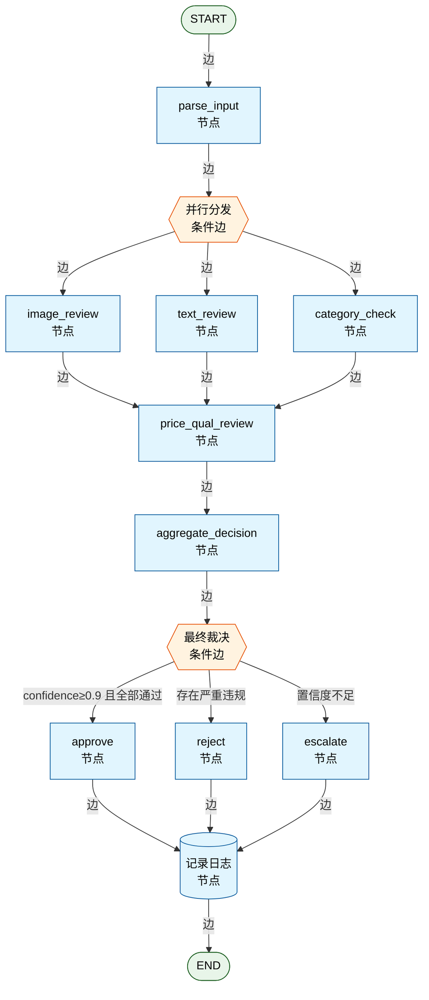

```mermaid
flowchart TD
    START([START]):::start
    A[parse_input<br/> 节点]:::node
    PARALLEL{{并行分发<br/> 条件边}}:::cond
    B[image_review<br/> 节点]:::node
    C[text_review<br/> 节点]:::node
    D[category_check<br/> 节点]:::node
    PQ[price_qual_review<br/> 节点]:::node
    E[aggregate_decision<br/> 节点]:::node
    DECISION{{最终裁决<br/> 条件边}}:::cond
    F[approve<br/> 节点]:::node
    G[reject<br/> 节点]:::node
    H[escalate<br/> 节点]:::node
    LOG[(记录日志<br/> 节点)]:::node
    END([END]):::start

    START -->| 边| A
    A -->| 边| PARALLEL
    PARALLEL -->| 边| B
    PARALLEL -->| 边| C
    PARALLEL -->| 边| D
    B -->| 边| PQ
    C -->| 边| PQ
    D -->| 边| PQ
    PQ -->| 边| E
    E -->| 边| DECISION
    DECISION -->|confidence≥0.9 且全部通过| F
    DECISION -->|存在严重违规| G
    DECISION -->|置信度不足| H
    F -->| 边| LOG
    G -->| 边| LOG
    H -->| 边| LOG
    LOG -->| 边| END

    classDef node fill:#e1f5fe,stroke:#01579b,color:#000
    classDef cond fill:#fff3e0,stroke:#e65100,color:#000
    classDef start fill:#e8f5e9,stroke:#1b5e20,color:#000
```