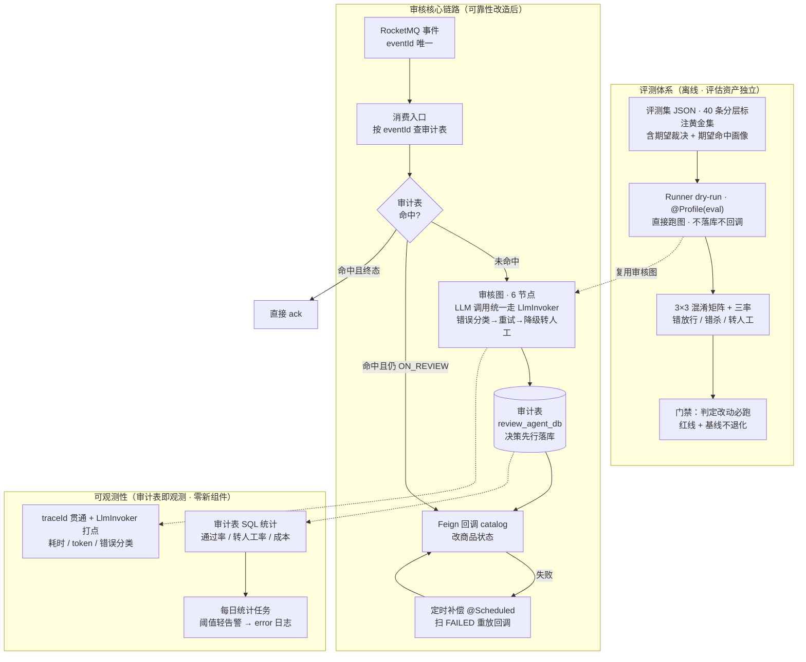
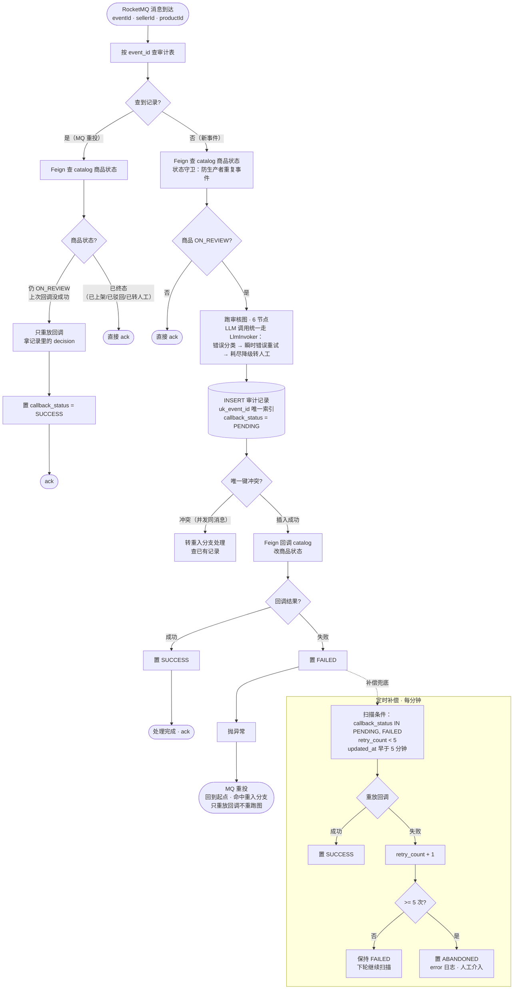
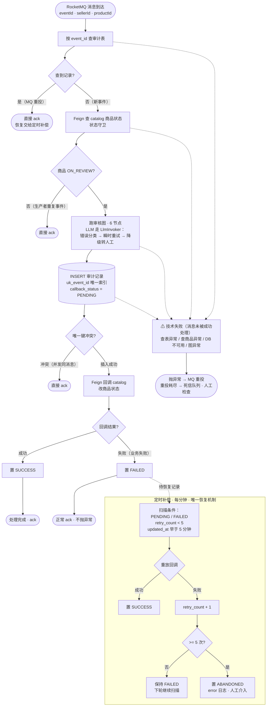
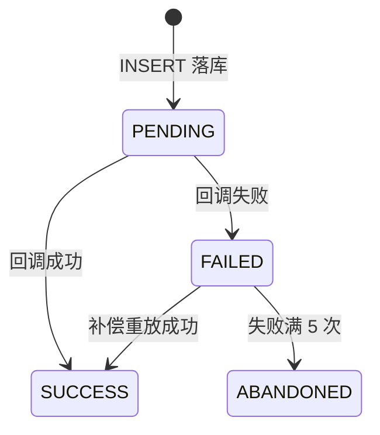

```mermaid

  flowchart TB
      subgraph EVAL["评测体系（离线 · 评估资产独立）"]
          E1["评测集 JSON · 40 条分层标注黄金集<br/>含期望裁决 + 期望命中画像"]
          E2["Runner dry-run · @Profile(eval)<br/>直接跑图 · 不落库不回调"]
          E3["3×3 混淆矩阵 + 三率<br/>错放行 / 错杀 / 转人工"]
          E4["门禁：判定改动必跑<br/>红线 + 基线不退化"]
      end

      subgraph CORE["审核核心链路（可靠性改造后）"]
          MQ["RocketMQ 事件<br/>eventId 唯一"]
          CONS["消费入口<br/>按 eventId 查审计表"]
          HIT{"审计表<br/>命中?"}
          GRAPH["审核图 · 6 节点<br/>LLM 调用统一走 LlmInvoker<br/>错误分类→重试→降级转人工"]
          AUDIT[("审计表<br/>review_agent_db<br/>决策先行落库")]
          CB["Feign 回调 catalog<br/>改商品状态"]
          COMP["定时补偿 @Scheduled<br/>扫 FAILED 重放回调"]
      end

      subgraph OBS["可观测性（审计表即观测 · 零新组件）"]
          O1["审计表 SQL 统计<br/>通过率 / 转人工率 / 成本"]
          O2["每日统计任务<br/>阈值轻告警 → error 日志"]
          O3["traceId 贯通 + LlmInvoker 打点<br/>耗时 / token / 错误分类"]
      end

      MQ --> CONS --> HIT
      HIT -- "未命中" --> GRAPH --> AUDIT --> CB
      HIT -- "命中且仍 ON_REVIEW" --> CB
      HIT -- "命中且终态" --> ACK["直接 ack"]
      CB -- "失败" --> COMP --> CB
      AUDIT -.-> O1 --> O2
      GRAPH -.-> O3
      E1 --> E2 --> E3 --> E4
      E2 -. "复用审核图" .-> GRAPH
```

```mermaid
  flowchart TD
      MQ([RocketMQ 消息到达<br/>eventId · sellerId · productId])
      --> SEL[按 event_id 查审计表]
      --> HIT{"查到记录?"}

      %% ============ 重入分支：记录存在 ============
      HIT -- "是（MQ 重投）" --> CHK[Feign 查 catalog 商品状态]
      --> ST{"商品状态?"}
      ST -- "仍 ON_REVIEW<br/>上次回调没成功" --> REPLAY[只重放回调<br/>拿记录里的 decision]
      --> UPD1[置 callback_status = SUCCESS]
      --> ACK1([ack])
      ST -- "已终态<br/>（已上架/已驳回/已转人工）" --> ACK2([直接 ack])

      %% ============ 主分支：记录不存在 ============
      HIT -- "否（新事件）" --> CHK2[Feign 查 catalog 商品状态<br/>状态守卫：防生产者重复事件]
      --> ST2{"商品 ON_REVIEW?"}
      ST2 -- "否" --> ACK3([直接 ack])
      ST2 -- "是" --> GRAPH["跑审核图 · 6 节点<br/>LLM 调用统一走 LlmInvoker：<br/>错误分类 → 瞬时错误重试 → 耗尽降级转人工"]
      --> INS[(INSERT 审计记录<br/>uk_event_id 唯一索引<br/>callback_status = PENDING)]
      --> DUP{"唯一键冲突?"}
      DUP -- "冲突（并发同消息）" --> ROUTE[转重入分支处理<br/>查已有记录]
      DUP -- "插入成功" --> CB[Feign 回调 catalog<br/>改商品状态]
      --> CBR{"回调结果?"}
      CBR -- "成功" --> UPD2[置 SUCCESS]
      --> DONE([处理完成 · ack])
      CBR -- "失败" --> UPD3[置 FAILED]
      --> THROW[抛异常]
      --> MQ2([MQ 重投<br/>回到起点 · 命中重入分支<br/>只重放回调不重跑图])

      %% ============ 定时补偿 ============
      subgraph COMP["定时补偿 · 每分钟"]
          SCAN["扫描条件：<br/>callback_status IN PENDING, FAILED<br/>retry_count < 5<br/>updated_at 早于 5 分钟"]
          --> LOOP{"重放回调"}
          LOOP -- "成功" --> S1[置 SUCCESS]
          LOOP -- "失败" --> RC[retry_count + 1]
          --> C5{">= 5 次?"}
          C5 -- "否" --> KEEP[保持 FAILED<br/>下轮继续扫描]
          C5 -- "是" --> AB[置 ABANDONED<br/>error 日志 · 人工介入]
      end

      UPD3 -. 补偿兜底 .-> SCAN
```

```mermaid
  flowchart TD
      MQ([RocketMQ 消息到达<br/>eventId · sellerId · productId])
      --> SEL[按 event_id 查审计表]
      --> HIT{"查到记录?"}

      HIT -- "是（MQ 重投）" --> ACK1([直接 ack<br/>恢复交给定时补偿])

      HIT -- "否（新事件）" --> CHK[Feign 查 catalog 商品状态<br/>状态守卫]
      --> ST{"商品 ON_REVIEW?"}
      ST -- "否（生产者重复事件）" --> ACK2([直接 ack])

      ST -- "是" --> GRAPH["跑审核图 · 6 节点<br/>LLM 走 LlmInvoker：<br/>错误分类 → 瞬时重试 → 降级转人工"]
      --> INS[(INSERT 审计记录<br/>uk_event_id 唯一索引<br/>callback_status = PENDING)]
      --> DUP{"唯一键冲突?"}
      DUP -- "冲突（并发同消息）" --> ACK3([直接 ack])

      DUP -- "插入成功" --> CB[Feign 回调 catalog<br/>改商品状态]
      --> CBR{"回调结果?"}
      CBR -- "成功" --> UPD2[置 SUCCESS]
      --> DONE([处理完成 · ack])
      CBR -- "失败（业务失败）" --> UPD3[置 FAILED]
      --> ACK4([正常 ack · 不抛异常])

      subgraph COMP["定时补偿 · 每分钟 · 唯一恢复机制"]
          SCAN["扫描条件：<br/>PENDING / FAILED<br/>retry_count < 5<br/>updated_at 早于 5 分钟"]
          --> LOOP{"重放回调"}
          LOOP -- "成功" --> S1[置 SUCCESS]
          LOOP -- "失败" --> RC[retry_count + 1]
          --> C5{">= 5 次?"}
          C5 -- "否" --> KEEP[保持 FAILED<br/>下轮继续扫描]
          C5 -- "是" --> AB[置 ABANDONED<br/>error 日志 · 人工介入]
      end

      THROW["⚠ 技术失败（消息未被成功处理）<br/>查表异常 / 查商品异常 / DB 不可用 / 图异常"]
      --> MQ2([抛异常 → MQ 重投<br/>重投耗尽 → 死信队列 · 人工检查])
      SEL -.-> THROW
      CHK -.-> THROW
      GRAPH -.-> THROW
      INS -.-> THROW

      UPD3 -. "待恢复记录" .-> SCAN
```

编码对照：PENDING(0) / SUCCESS(1) / FAILED(2) / ABANDONED(3)

```mermaid
  stateDiagram-v2
      [*] --> PENDING: INSERT 落库
      PENDING --> SUCCESS: 回调成功
      PENDING --> FAILED: 回调失败
      FAILED --> SUCCESS: 补偿重放成功
      FAILED --> ABANDONED: 失败满 5 次


```